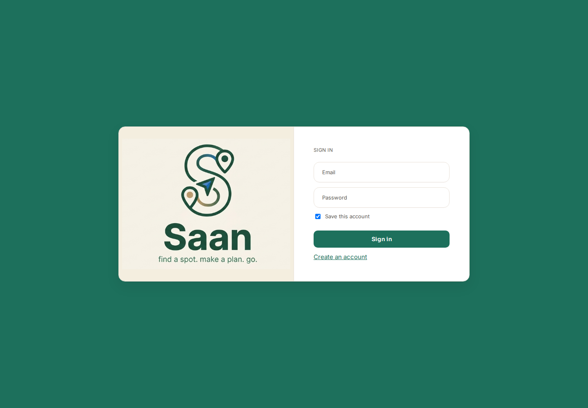

# Saan

## 1. Overview

Saan helps people discover cafés, restaurants, bars, bakeries, and bookstores around Angeles City, then organize places into shareable outing itineraries. It is a web app for locals and visitors who want one place to find spots, read or post reviews, and plan where to go.

[](AI-USAGE.md)

## 2. Setup and installation

### Prerequisites

- Node.js 18 or newer and npm.
- A Supabase project with its hosted PostgreSQL database. No local PostgreSQL installation is needed.
- Git.

### 1. Get the code

```bash
git clone https://github.com/JLG-N/Saan.git
cd Saan
```

### 2. Create and prepare the database

1. Create a project at [supabase.com](https://supabase.com).
2. In the Supabase dashboard, open **SQL Editor** and run the contents of [`backend/schema.sql`](backend/schema.sql).
3. In **Project Settings → Database**, copy a PostgreSQL connection URI. The backend guide recommends the transaction pooler URI (port `6543`).
4. Seed the database after configuring the backend and installing dependencies below. The seed script adds 30 spots; it does not create a user account.

### 3. Configure the environment

Create `backend/.env` (do not commit it) with these values:

```dotenv
DATABASE_URL=postgresql://<user>:<password>@<host>:6543/postgres
JWT_SECRET=<at-least-32-bytes-of-random-data>
PORT=3001
```

Replace the database URI placeholders with the URI from your Supabase project. `DATABASE_URL` and `JWT_SECRET` are required. `JWT_SECRET` must contain at least 32 bytes of random data and should remain private and stable between restarts. Generate one locally, for example:

```bash
node -e "console.log(require('crypto').randomBytes(32).toString('base64url'))"
```

`PORT` is optional and defaults to `3001`; the Vite development proxy also targets port `3001`, so if you change it, update `frontend/vite.config.js` to match.

For a non-local frontend deployment, the optional `VITE_API_BASE` variable sets the backend origin (for example, `https://api.example.com`, with no trailing `/api`). It is not needed for local development: the Vite proxy forwards `/api` requests to `http://localhost:3001`.

### 4. Install dependencies and seed

Install the backend and frontend dependencies:

```bash
cd backend
npm install
cd ../frontend
npm install
```

Seed the database:

```bash
cd backend
npm run seed
```

The seed command skips inserts if the `spots` table already contains data. It does not add a demo login; create your own account from the app's sign-up screen.

## 3. How to run it

Run the API and web app in separate terminals from the repository root.

**Terminal 1 — API:**

```bash
cd backend
npm start
```

The API should log `Saan API listening on http://localhost:3001`. Its health endpoint at [http://localhost:3001/api/health](http://localhost:3001/api/health) returns `{"ok":true}`.

**Terminal 2 — web app:**

```bash
cd frontend
npm run dev
```

Open the local URL printed by Vite, normally [http://localhost:5173](http://localhost:5173). The first screen is Saan's sign-in page. Choose **Create an account** to register, then browse the seeded spots. The Supabase database and API must be available for sign-up, sign-in, and data-backed features.

## 4. Features and usage

1. **Create an account or sign in.** Choose whether to save the session on the device.
2. **Discover places.** Search by name or location text and filter by category. Open a spot to see its details and reviews; signed-in users can post a star rating and optional comment.
3. **Build an outing.** Add a spot to a new or existing plan. In the plan editor, search for other spots, rename the plan, remove stops, and move stops up or down to set the itinerary order.
4. **View and share a plan.** A plan detail page shows its ordered stops and a Google Maps route. Share a read-only link with others, or stop sharing to revoke it.
5. **Manage the account.** Visit Profile to see account details, toggle saved-session behavior, browse spots saved during the current session, sign out, or delete the account.

### API

All paths below are prefixed with `/api`. Protected endpoints require the JWT returned by sign-up or sign-in to be sent as a bearer token in the `Authorization` header. Tokens expire after seven days.

| Method | Path | Purpose |
|---|---|---|
| GET | `/health` | Check that the API is running. |
| POST | `/auth/signup` | Create an account; body: `{ "email", "password", "name" }`. |
| POST | `/auth/login` | Sign in; body: `{ "email", "password" }`. |
| GET | `/auth/me` | Return the authenticated account. |
| DELETE | `/auth/me` | Permanently delete the authenticated account and its plans/reviews. |
| GET | `/spots` | List public spots; optional `category` and `q` filters. |
| GET | `/spots/:id` | Get spot details and reviews. |
| POST | `/spots/:id/reviews` | Post a review; authenticated body: `{ "rating": 1-5, "comment": "optional" }`. |
| GET | `/plans` | List the authenticated user's plans and ordered spots. |
| POST | `/plans` | Create a plan; body: `{ "title": "..." }`. |
| GET | `/plans/:id` | Get one of the authenticated user's plans. |
| PUT | `/plans/:id` | Rename a plan; body: `{ "title": "..." }`. |
| DELETE | `/plans/:id` | Delete a plan. |
| POST | `/plans/:id/spots` | Add a spot; body: `{ "spotId": "..." }`. |
| DELETE | `/plans/:id/spots/:spotId` | Remove a spot from a plan. |
| PUT | `/plans/:id/reorder` | Reorder plan stops; body: `{ "spotIds": ["...", "..."] }`. |
| POST | `/plans/:id/share` | Enable read-only sharing and return a `shareToken`. |
| DELETE | `/plans/:id/share` | Revoke the plan's share link. |
| GET | `/shared/:token` | Public, read-only view of a shared plan. |

## 5. Project structure

```text
.
├── README.md
├── AI-USAGE.md                AI-assistance disclosure
├── backend/
│   ├── server.js              Express API entry point and health endpoint
│   ├── config.js              Environment validation and port configuration
│   ├── db.js                  PostgreSQL connection pool
│   ├── schema.sql             Database tables and indexes
│   ├── seed.js                Inserts the sample spots
│   ├── middleware/auth.js     JWT authentication
│   └── routes/                Auth, spots/reviews, plans, and shared plans
└── frontend/
    ├── index.html             Vite app document
    ├── vite.config.js         React plugin and local API proxy
    └── src/
        ├── App.jsx            App navigation and screen selection
        ├── api/api.js         Frontend API client
        ├── components/        Shared UI, spot cards, and plan map
        ├── context/           Account/session state
        ├── screens/           Sign-in, discovery, spot, plan, and profile screens
        └── styles/            Application styles
```

## 6. Screenshots



## 7. Known issues and next steps

- Spot favorites are held in frontend memory and are cleared on sign-out or page reload; they are not saved to the account or database.
- The Discover screen's previous/next footer is currently presentation-only; the spot list is not paginated.
- The seed script skips all spot inserts when it finds any existing spot rows. To refresh or reset seed data, back up any needed data and clear the relevant Supabase tables before running it again.
- The route map is embedded from Google Maps and spot photos are remote Unsplash URLs, so those visual elements need an internet connection.
- The repository does not currently define automated test scripts. Add backend route/database tests and frontend interaction tests as a next step.

The repository's [security checklist](SECURITY-CHECKLIST.md) records current findings and items that still need verification before public deployment. The [AI usage log](AI-USAGE.md) describes AI-assisted work and is kept up to date.
